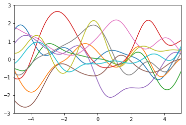
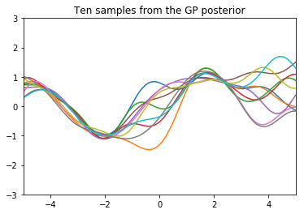
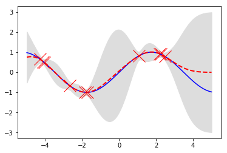

# Gaussian Processes Simple Examples

This is taken from the course Machine Learning and Pattern Recognition from the University of Edinburgh, with professor Aian Murray. Support code is taken from the course CPSC540, professor Nando de Freitas when we was at UBC

This repo shows and exaplains how to get a general model of Gaussian Process, it shows how to sample from the prior:

How to sample models from the posterior

and the final prediction of the model

## TODO

* Derive the math for the explicit forms for the variance and the mean on the predictions
